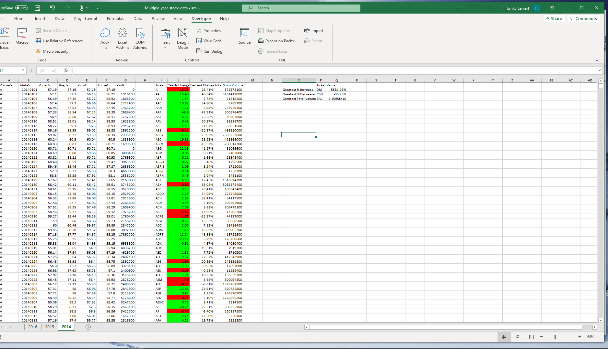
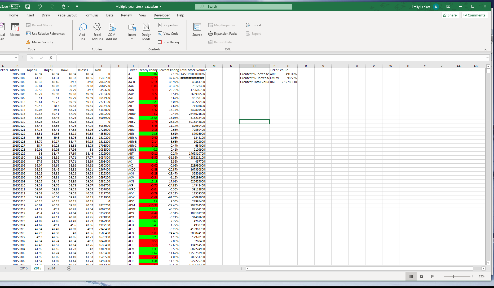
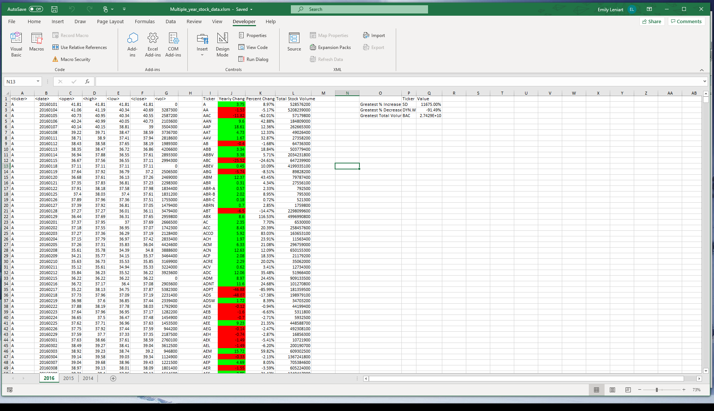

# VBA-challenge
## Table of contents
* [General info](#general-info)
* [Technologies](#technologies)
* [Information](#information)
* [Multi Year Stock Data](#multi-year-stock-data)

## General info
This challenge was to create a loop though all the stocks for one year and Input the information. The bonus (included in photos), was to present the Greatest % Increase, Greatest % Decrease and Greatest Toal Volume of the Stock Analysis.
	
## Technologies
Project is created with:
* Microsoft Excel
* Macros
* Visual Basics
	
## Information
To view 'Multi Year Stock Data' results:
	open "Stock Analysis ScreenShots"

To view 'Test Data"
	open 'alphabetical_testing.xlm'

To view script used for 'Stock Data' & 'Test Data':
	open VBA Script.bas
	
## Multi Year Stock Data

